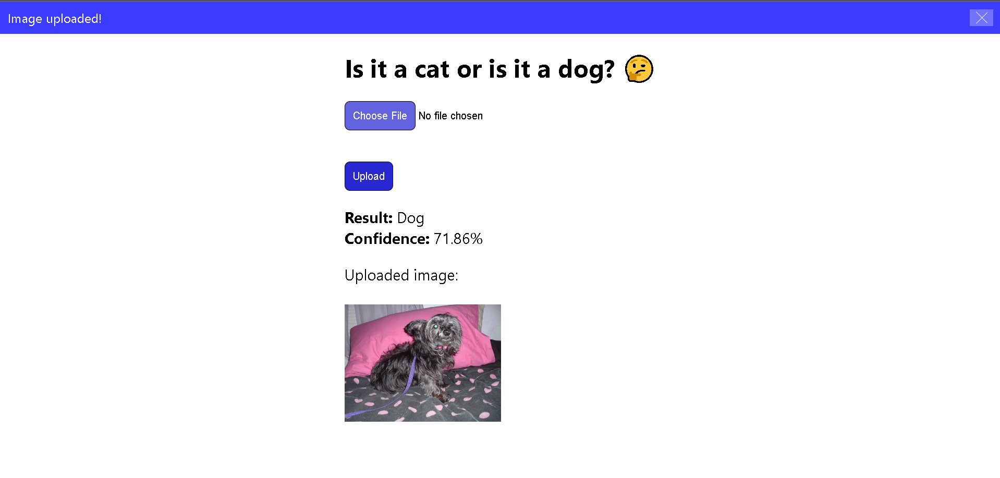

# Is it a cat or is it a dog? 🤔

This is an AI model developed using `tensorflow==2.13.0`.

The model is saved as `cats_and_dogs.keras`

All of the code used to create the model is in `cats_and_dogs.ipynb`.

Model's performance: `loss: 0.4881 - accuracy: 0.7674 - val_loss: 0.5053 - val_accuracy: 0.7527`.

As you can see, it is not a perfect model but it can at least differentiate between dogs and cats quite a lot more than 50% of the time. It does fail sometimes though. This is largely due to lack of computing power on my part. The model has only been trained for 3 epochs, it requires a bit more epochs to be well trained. I could reduce the image size but I would prefer for the network to learn the patterns properly.

If you upload neither a dog nor a cat you get nonesensical results.

Demo:

## References:

- [Tensorflow Tutorial by youtuber sentdex](https://www.youtube.com/watch?v=wQ8BIBpya2k&list=PLQVvvaa0QuDfhTox0AjmQ6tvTgMBZBEXN)

- [Download kaggle dogs and cats dataset](https://www.microsoft.com/en-US/download/details.aspx?id=54765)
